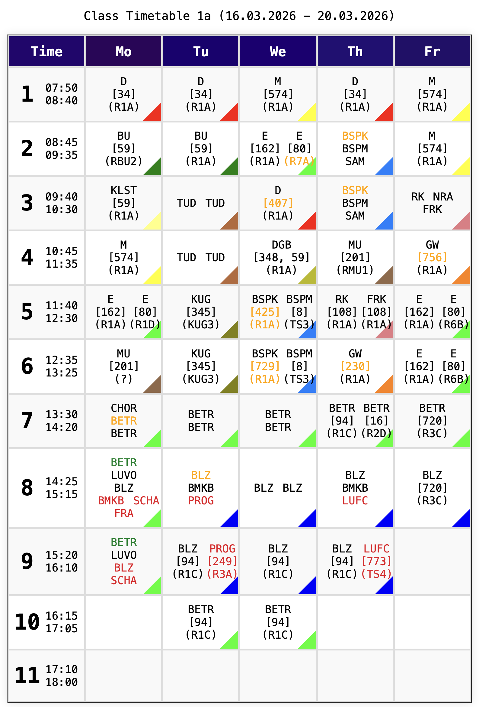

from mypyc.transform.log_trace import get_load_global_name<br/>
<div align="center">
  <h3 align="center">🕞 Untis</h3>

  <p align="center">
    Python library for interacting with WebUntis
    <br />
    <br />
    <a href="#1-installation">Installation</a> •
    <a href="#2-quickstart">Quickstart</a> •
    <a href="#3-documentation">Documentation</a> •
    <a href="#4-license">License</a>
  </p>
</div>

<div align="center">
  
</div>
<br>

> Note: Teacher names have been replaced with placeholder numbers for privacy.


> [!CAUTION]
> More documentation will follow soon.

## 1. Installation

`pip install untis`

## 2. Quickstart

```python
import untis

global_session = untis.objects.Session(
    'global_session',
    use_cache=False,
    cache_file=None,
    logger=None,
    username='insert_your_username',
    password='insert_your_password',
    server='insert-your-school.webuntis.com/WebUntis',
    school='insert-your-school',
    client='WebUntis Test'
)

# Safe under concurrency
call_id = global_session.get_unique_uuid()
global_session.log_in(call_id)

for klasse in global_session.all_klassen():
    print(klasse.name)

global_session.log_out(call_id)
```
[read more...](docs/index.md)

## 3. Documentation

See [Index](docs/index.md) for full usage and API details.

## 4. License

See [License](LICENSE).
